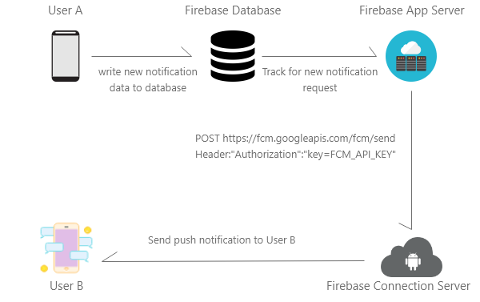
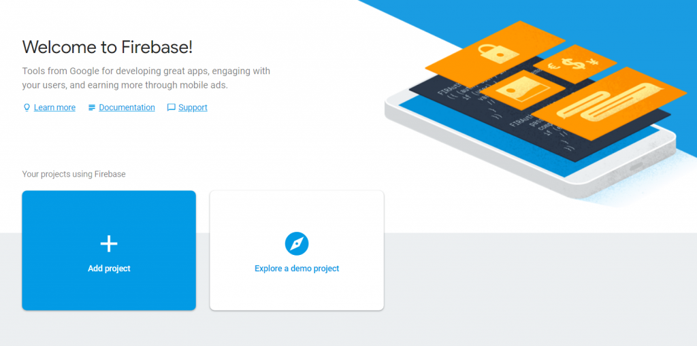
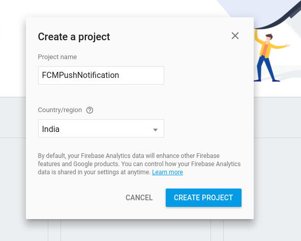
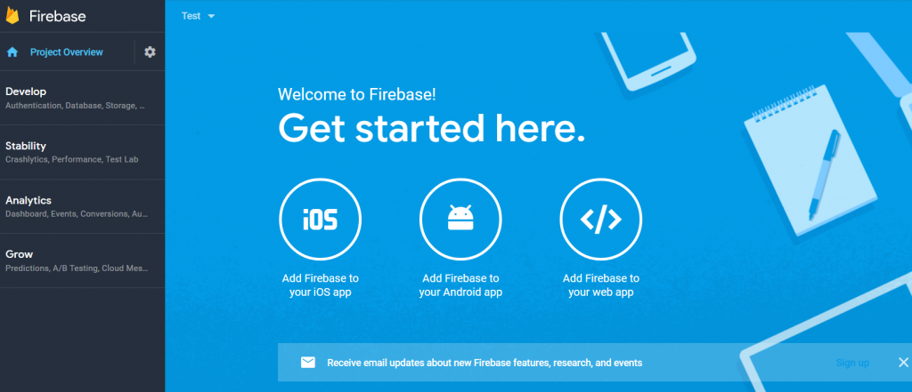
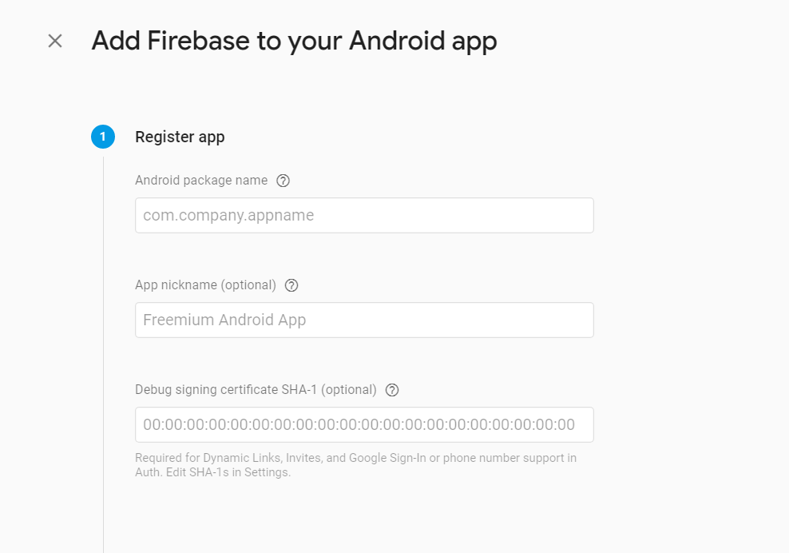
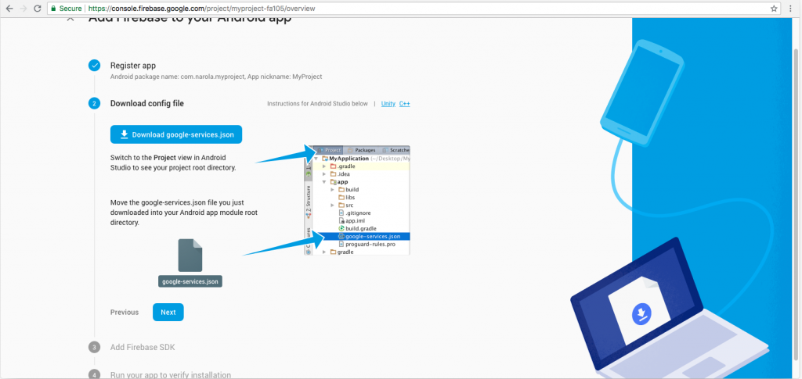
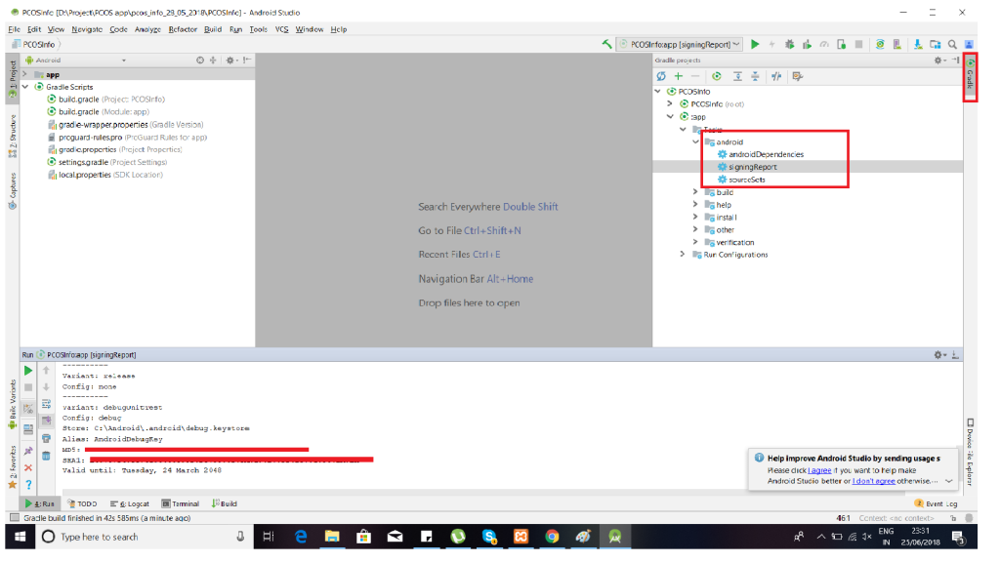

Ref and Code Taken for analysis : Github Firebase Push Notification Tutorial https://github.com/Hardik8184/FirebasePushNotification

Firebase Push Notification Tutorial

<h2 style="text-align: left;"><strong>How Firebase Push Notification works?</strong></h2>

Firebase serves as a module between your server and the devices that will be receiving the push notifications that you create. Your server informs Firebase that a notification has to be sent. Then Firebase does the work behind the scenes to get the notification published.

&nbsp;

<h2 style="text-align: left;"><strong>How to integrate FCM into Android Project?</strong></h2>

Step for creating  Firebase Project

<strong><em>Step 1:</em></strong> Open Firebase <a href="https://console.firebase.google.com/u/2/?pli=1">console</a>

<em><strong>Step 2: </strong></em>Click on Add project and give name to your project and select country. If you have already created a project skip this step.

 

<em><strong>Step 3: </strong></em>Then select “Add Firebase to your Android app”.

 

<em><strong>Step 4: </strong></em>Add project package id or application id and genrate SHA-1 signatature of your machine.

 

<em><strong>Step 5: </strong></em>Download google-service.json and put into app module.

 

<h2><strong>How to generate SHA Key using Android Studio:</strong></h2>
<ol>
<li>Open your project into Android studio.</li>
<li>Click on Gradle tab on right side.</li>
<li>Collapse :app module -&gt; Tasks -&gt; Android -&gt; signing report.</li>
<li>SHA-1 will generate. Copy and paste into SHA-1 in firebase console.</li>
</ol>

<h2><strong>How to integrate Firebase SDK into Android Project?</strong></h2>

<em><strong>Step 1:</strong></em>

Add below code into &lt;project&gt;/build.gradle file.

<pre class="line-numbers" data-start="1"><code class="language-markup">buildscript {
  dependencies {
    // Add this line
    classpath 'com.google.gms:google-services:4.3.2'
  }
}</code></pre>

<em><strong>Step 2:</strong></em>

Add below code into &lt;project&gt; / &lt;app&gt;/build.gradle. 

<pre class="line-numbers" data-start="1"><code class="language-kotlin">dependencies {
  // Add this line
  implementation 'com.google.firebase:firebase-messaging:20.0.0'
}
...
// Add to the bottom of the file
apply plugin: 'com.google.gms.google-services'</code></pre>

<em><strong>Step 3:</strong></em>

Press on sync now in the Android Studio.

<h2><strong>Now you can send Push Notification using Firebase Console</strong></h2>

  1. Go to firebase console and select the app you created.
  2. From the left menu select notification.
  3. Click on new message.
  4. Enter message, select single device and paste the token you copied and click on send. The same as I did on the video, and check your device
  

Analysis On Notifications Channel Settings:

There will be majorly 2 options :

1. Remove Notification Channel Setting which is manually done by user without user consent : *Which is not possible as per android documentation. (https://developer.android.com/reference/android/app/NotificationManager#createNotificationChannel(android.app.NotificationChannel))*

here is some findings  from Internet you can check the below links as well.

You should recreate the channel just as you created it for the first time. The createNotificationChannel command will create the channel if it hasn't been created yet, and it will update the channel if it has been already created.
If the channel is already created, then the only thing you can change is the name of the channel and the channel description, nothing else. The importance will be ignored, because the user might have already changed the importance of the channel manually. But even if they hasn't changed that, still the importance won't be updated, and actually that's the purpose of the notification channels. To give freedom to the users to manage their channels, without the developers messing with them when the app is updated.

So in summary, by declaring:

NotificationChannel notificationChannel = new NotificationChannel(CHANNEL_ID, “newName”, NotificationManager.IMPORTANCE_DEFAULT);
notificationManager.createNotificationChannel(notificationChannel);

in an already created channel, the name of the channel will be updated, but not the importance. If you want to update the channel description as well, you can do that like that:

notificationChannel.setDescription("new description"); //set that before creating the channel



So, From here we conclude that we doesn’t need option one solution, we need to override the settings of user device.



Ref 1: https://developer.android.com/training/notify-user/channels

Ref 2: https://stackoverflow.com/questions/45081815/android-o-notification-channels-change-vibration-pattern-or-sound-type

Ref 3: https://stackoverflow.com/questions/52364032/how-to-properly-update-notification-channel-android-oreo



2.Delete Notifications Channels and make the channels again.



To create notification channel, we will create the same channel name but we will change the channel_id for that we need to create a unique identifier. For ex. Currently we use channel id as : mydefaultchannel but to achieve or solve this case we should use mydefaultchannel1 or mydefaultchannel_1 or anyother of your choice. Channel id is never will be on the frontend or it is not be for user it is only for the system to manage settings.

Issues is open, you can write to me.

Thanks.
